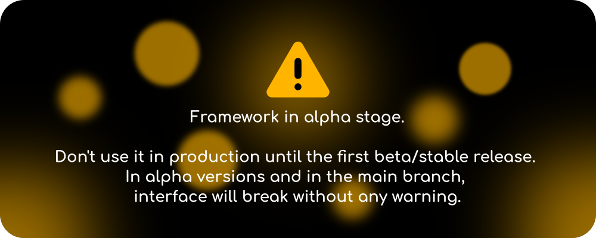

<h1 align="center">The Rextra Framework</h1>

The project is under rebranding. 
JDA-Extra is the old name, the project was forked, and now it's **Rextra**!
In the future it's planned to adapt the framework for the [Revolt](https://revolt.chat/) platform, using my own library - **Revager** (**under development**).

Original repo: https://gitlab.com/DWolf_19/JDA-Extra


---
Design: thanks to [@nelifs](https://github.com/nelifs)! 
_Discord logo is a registered trademark of [Discord](https://discord.com/)._

A modern and evolving commands & components framework for JDA. Inspired by [BotCommands](https://github.com/freya022/BotCommands) and motivated by [JDA-Utilities](https://github.com/JDA-Applications/JDA-Utilities).



### 🔗 Useful links

* [Source code (GitLab)](https://gitlab.com/DWolf_19/JDA-Extra)
* [GitHub mirror (read-only)](https://github.com/DWolf-19/JDA-Extra)
* [Join to our Discord for support](https://discord.gg/QN7Ef2KGkU)
* [Maven repository](https://repo.dwolfnineteen.com/)
* [Javadoc (latest)](https://repo.dwolfnineteen.com/javadoc/alpha/com/dwolfnineteen/JDA-Extra/latest)

### 🔨 Requirements

* JDK 17+

### 🗃️ Different release channels

* Stable releases: https://repo.dwolfnineteen.com/releases (e.g. `1.0.0`)
* Beta releases: https://repo.dwolfnineteen.com/beta (e.g. `1.0.0-beta.1`)
* [**Currently only this option is available**] Alpha releases: https://repo.dwolfnineteen.com/alpha (e.g. `1.0.0-alpha.1`)
* Experimental releases: https://repo.dwolfnineteen.com/experimental (e.g. `1.0.0-exp.1`)

### 🚀 Installation

**Gradle (Kotlin DSL):**
```kotlin
repositories {
    mavenCentral()
    maven { url = uri("https://repo.dwolfnineteen.com/alpha") }
}

dependencies {
    implementation("com.dwolfnineteen:JDA-Extra:1.0.0-alpha.2")
}
```

**Gradle (Groovy DSL):**
```groovy
repositories {
    mavenCentral()
    maven { url "https://repo.dwolfnineteen.com/alpha" }
}

dependencies {
    implementation "com.dwolfnineteen:JDA-Extra:1.0.0-alpha.2"
}
```

**Maven:**
```xml
<repositories>
    <repository>
        <url>https://repo.dwolfnineteen.com/alpha</url>
    </repository>
</repositories>

<dependencies>
    <dependency>
        <groupId>com.dwolfnineteen</groupId>
        <artifactId>JDA-Extra</artifactId>
        <version>1.0.0-alpha.2</version>
    </dependency>
</dependencies>
```

### 🔑 Features

* 🚀 Annotation-based and flexible design.
* 🧬 Hybrid commands (write code once, run as both prefix and slash command).
* ⚒️ Modular architecture, easy navigation in API.

**Planned:**
* Cooldowns
* Context commands
* Advanced error handling
* Various utilities
* Components

...and more!

### 🧪 Getting started

Code examples will be added when the framework architecture stabilizes.

### 🧡 Special thanks


[JetBrains](https://www.jetbrains.com/) for [OSS development license](https://www.jetbrains.com/community/opensource/#support) and the best Java IDE!
